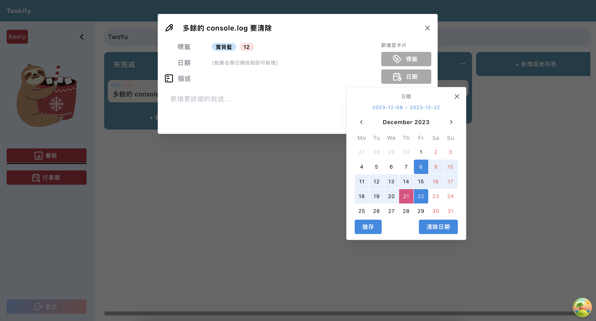

# Taskify

這是一個基於Trello啟發的練習專案，雖然Todolist是一個老主題，但我們認為有很多延伸的主題可以去發揮與實作，我們期許透過此專案的實作經驗來加深對於React的熟悉度。

## 使用技術

### 前端
- React
- TypeScript
- React Router
- React Query
- Mantine
- Sass

### 後端
- Spring Boot
- Spring Security
- Spring Data jpa

### DB
- Postgres

### 部署平台
- zeabur
  
## 頁面介紹

### 登入
目前只有一般的帳號密碼登入方式，

- 測試帳號:user1@example.com 
- 測試密碼:user

### 任務看板
看板頁面為網站主要的頁面，看板下會有列表，列表則可以去新增不同的任務，現階段可以對列表及任務做CRUD，新增不同的看板則在預計完成的項目內。

看板還有一個標籤功能，我們可以去新增不同的顏色及名稱， 並在任務中去選擇，
標籤運用colorPicker去選擇自己喜歡的顏色:

為任務選擇標籤:

在任務的modal內可以新增任務的日期區間，用以跟行事曆頁面做同步:

### 行事曆
新增任務日期後，同步到行事曆Page，一目瞭然整個月的任務目標:

### 其他功能

可以關閉navbar，展開右側page畫面:

## 待完成功能
- 註冊功能
- 忘記密碼
- 使用者可以有多個board
- 前後端單元測試
- Refresh token 機制
- DND
- 第三方登入
- 成員、看板照片、任務附件
- Email 認證帳號
